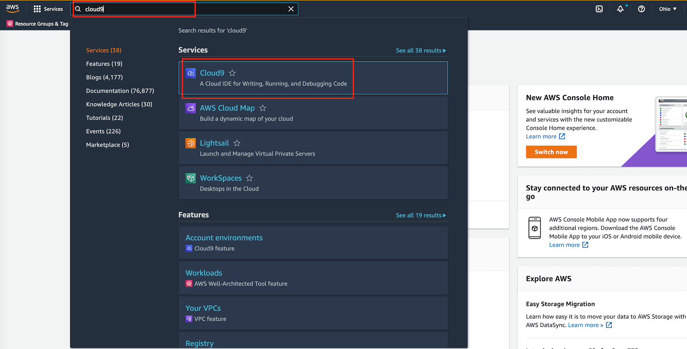
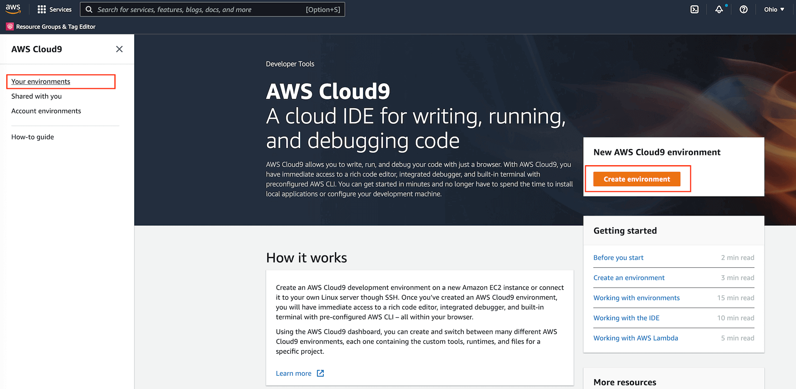
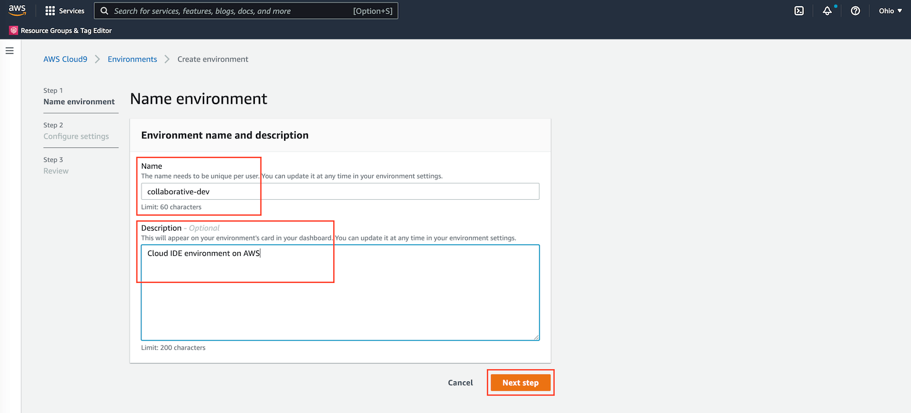
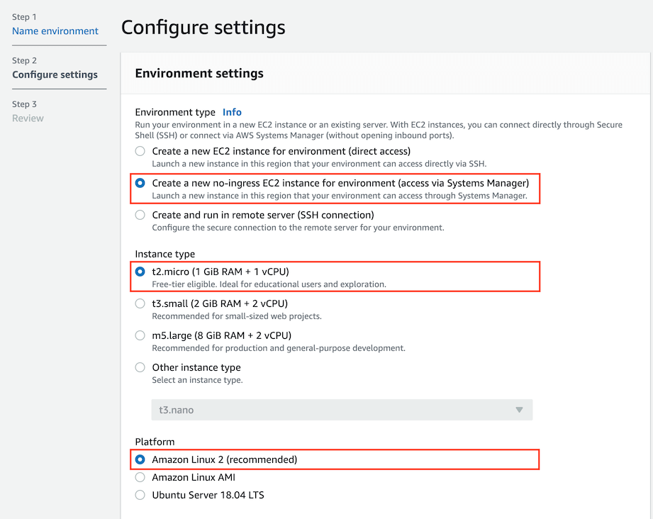
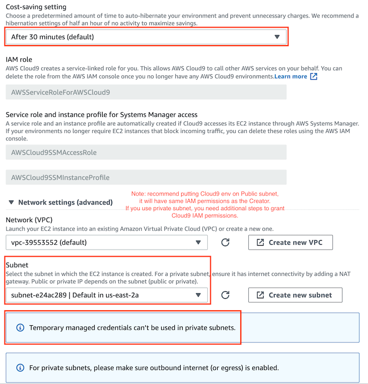
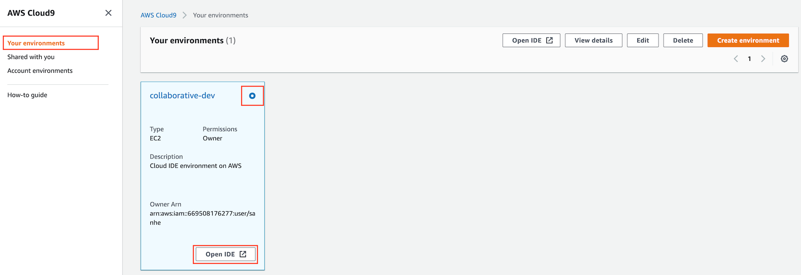
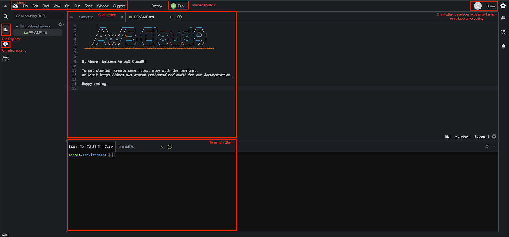

AWS Opensearch Examples
==============================================================================

.. contents::
    :depth: 1
    :local:

Overview
------------------------------------------------------------------------------
This is an unofficial tutorial to boost your AWS OpenSearch (The open source version of ElasticSearch) knowledge level from ZERO to HERO.

This tutorial is NOT designed for self pace learning, it is given by an experienced AWS Opensearch expert.

Prerequisite:

- a sandbox AWS Account to play with
- basic Python knowledge

.. _set_up_development_environment_using_aws_cloud9:

1. Set up Development Environment using AWS Cloud 9
------------------------------------------------------------------------------
.. contents::
    :depth: 1
    :local:

Why Cloud 9
~~~~~~~~~~~~~~~~~~~~~~~~~~~~~~~~~~~~~~~~~~~~~~~~~~~~~~~~~~~~~~~~~~~~~~~~~~~~~~
1. **You can use any poor hardware computer with any operational system. You just need a Web Browser**.
2. **Seamless collaborative coding experience** for engineering teams.
3. **Advanced System Security and Network Security** out of the box. Protect your files / code / network traffic never leave your AWS environment.
4. Native authentication support to use AWS CLI / SDK API.
5. First class Git support for source code version control.
6. The underlying OS and kernel is a Redhat liked Linux OS, and also similar to AWS Lambda container runtime. As a result, the installed python library can be directly used in AWS Lambda. If you build the Lambda dependencies on Windows, MacOS or other Linux, it may not work in AWS Lambda.

Create Cloud 9 Environment
~~~~~~~~~~~~~~~~~~~~~~~~~~~~~~~~~~~~~~~~~~~~~~~~~~~~~~~~~~~~~~~~~~~~~~~~~~~~~~
The native of Cloud 9 environment is just a EC2 virtual machine in your AWS environment on VPC. Follow this document to create your environment.

- Creating an EC2 Environment: https://docs.aws.amazon.com/cloud9/latest/user-guide/create-environment-main.html

Use Cloud 9 IDE
~~~~~~~~~~~~~~~~~~~~~~~~~~~~~~~~~~~~~~~~~~~~~~~~~~~~~~~~~~~~~~~~~~~~~~~~~~~~~~
Things to know:

- Top main menu: classic IDE liked menu.
- Left side tool menu: search anything, file explorer, SVC tool, AWS explorer.
- File explorer: create / edit / rename / move / delete file and folder, show hidden files.
- Code Editor: hot key for save / comment / close tab / etc ...
- Terminal: a local terminal with bash shell, you can use other shells too.
- AWS Credential Management: manage the AWS access for your Cloud 9 VM.
- Use EC2 instance Profile when using Cloud 9 in Private subnet: the AWS Managed credential won't work when Cloud 9 is on Private subnet. You should consider using EC2 instance profile.

Reference:

- Working with IDE: https://docs.aws.amazon.com/cloud9/latest/user-guide/ide.html

Use AWS Cloud 9 with Github
~~~~~~~~~~~~~~~~~~~~~~~~~~~~~~~~~~~~~~~~~~~~~~~~~~~~~~~~~~~~~~~~~~~~~~~~~~~~~~
This tutorial shows how to securely pull and push a Private Github Repository on AWS Cloud 9.

1. Generate a GitHub personal access token (GitHub recommended way) for Authentication:

    Go to GitHub -> Settings -> Developer Settings -> Personal access token -> Create one token -> grant the token Repo Read / Write access -> Store it securely.

2. Clone the Repo:

.. code-block:: bash

    # Store token in a variable, so you don't need to copy and paste it insecurely
    GH_TOKEN="abcd1234...."

    # Clone the Repo with the Token
    git clone https://${GH_TOKEN}@github.com/your-github-account-name/your-repo-name.git

3. Pull latest Code (Skip this if you prefer git cmd):

    There's a Git VCS ICON on your left top tool bar. You can see the cloned repo there.

    There's a Git Sync ICON on your left bottom tool bar. You can click to sync (Push and Pull) the code to / with remote.

3. Make change and Commit (Skip this if you prefer git cmd):

    Go to Git VCS menu, click on the ``+`` near the ``Change`` menu to add changes to git. It is ``git add`` equivalent.

    Enter commit message in the message box, click on the icon near your repo name, choose commit. Or you can just go to terminal and do ``git commit -m "your commit message"``

4. Push to Remote:

    Just click the Git Sync ICON, or ``git push``

5. Manage branch:

    There's a Git Branch Icon on your left bottom tool bar. You can create / delete / switch branch in the branch menu.

2. Setup Python Development Environment in Cloud 9
------------------------------------------------------------------------------
You can do the develop from your local MAC laptop. For windows computer, some linux command may not work properly.

Another easy way is to create a AWS Cloud 9 dev environment, it is a cloud IDE environment on a EC2 virtual machine. It only takes a few clicks and a few minutes to create one, so you can start development from any computer. You can find a set_up_development_environment_using_aws_cloud9_.

1. Check your current system Python and virtualenv CLI

.. code-block:: bash

    # show full path of python interpreter
    which python

    # show python version
    python --version

    # show full path of virtualenv cli
    which virtualenv

2. Clone this repo and CD into it

.. code-block:: bash

    # clone the repo
    git clone https://github.com/MacHu-GWU/aws_dla_opensearch_examples.git

    # cd into the repository root directory
    cd ./aws_dla_opensearch_examples

3. Create virtualenv:

.. code-block:: bash

    # create virtualenv
    virtualenv venv

    # activate the virtualenv, you should see (venv) at begin
    source ./venv/bin/activate

    # pip install learn_opensearch package on your local
    # you can make your code importable from virtual env
    pip install -e .

4. Configure Runner to use virtualenv python.

Cloud 9 top menu -> Run -> Run With -> New Runner

.. code-block:: javascript

    // Create a custom Cloud9 runner - similar to the Sublime build system
    // For more information see http://docs.aws.amazon.com/console/cloud9/create-run-config
    {
        "cmd" : ["/home/ec2-user/environment/venv/bin/python", "$file", "$args"],
        "info" : "Started $project_path$file_name",
        "env" : {},
        "selector" : "source.ext"
    }

Follow the Jump Start Tutorial
------------------------------------------------------------------------------
Read through this `tutorial <tutorial>`_, and replay those sample python scripts.

Additional Learning Resource
------------------------------------------------------------------------------

- OpenSearch doc: https://opensearch.org/docs/latest
