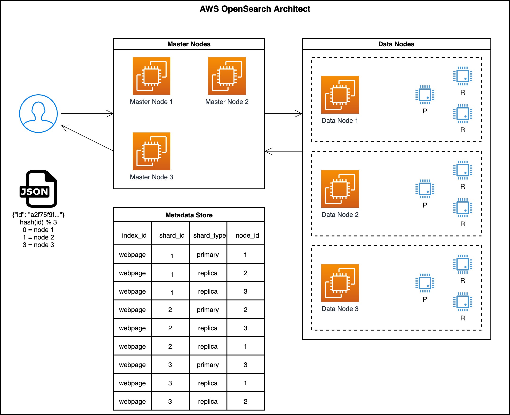

Important Concepts
==============================================================================

.. contents::
    :depth: 1
    :local:

Document
------------------------------------------------------------------------------
Similar to RDBMS Row. A JSON liked object::

    {
        customer_id: 10001,
        customer_name: "Barrack Obama",
        customer_dob: "1961-08-04",
        customer_description: "44th president of the United State, ...",
        account_balance: 300_000,
        account_type: "Checking",
    }

Index
------------------------------------------------------------------------------
Similar to RDBMS Table.

Mapping
------------------------------------------------------------------------------
Similar to RDBMS Index. defines how to index each field.

Cluster
------------------------------------------------------------------------------
Server external request as a whole. Expose a URL endpoint to external.

Node
------------------------------------------------------------------------------
Concrete Server, a VM, an AWS EC2 Instance.

Shard
------------------------------------------------------------------------------
Basic Write / Read / Storage Unit

Understand the Architect
------------------------------------------------------------------------------
**Architect**:

**What happens when write a Document**:

1. Client Start Write Request
2. Master Node receives the traffic, Decide which shard takes the traffic based on ID
3. Master Node Locate the node where the primary shard locate at
4. Master Node forward the traffic to Data Node and the primary shard
5. Primary shard forward write to regular shard replica
6. >= 1/2 * N replica acknowledge success then reply to master node success and also write the data to primary shard
7. Master Node send Client success response

**What happens when read a Document**:

1. Client Start Read Request
2. Master Node receives the traffic, Decide which shard takes the traffic based on ID
3. Shard receives the request and locate the ID using Index
4. Return the response to the client

**What happens when search a Document**:

1. Client Start Search Request
2. Master Node receives the traffic, spread the query to all shard
3. Shard perform the search using Index / Scan
4. Master Node aggregate the result, do pagination / aggregation / ordering / limit
5. Return the response to the client

More Advanced Concepts
------------------------------------------------------------------------------

- Segment
- In Memory Heap
